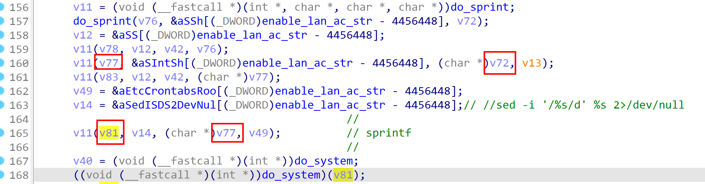

## Information

- **Vendor of the products:** COMFAST

- **Vendor's website:** http://www.comfast.cn/

- **Reported by:** CurryRaid (745843191@qq.com)

- **Affected products:** COMFAST CF-XR11

- **Affected firmware version:** V2.7.2

- **Firmware download address:** http://www.comfast.com.cn/index.php?m=content&c=index&a=lists&catid=31#orientate

## Overview

- `COMFAST CF-XR11 V2.7.2` has a command injection vulnerability in function `sub_424CB4`.
-  Attackers can send `POST` request messages to `/usr/bin/webmgnt` and inject evil commands into parameter `iface` to execute arbitrary commands by `/cgi-bin/mbox-config?method=SET&section=timing_redial`

## Product parameters

- `COMFAST CF-XR11 V2.7.2` is an 1800Mbps smart MESH router. The test version(the newest version) here is `V2.7.2`

## Vulnerability details

- The vulnerability is detected at `/usr/bin/webmgnt`.

- In the function `sub_424CB4`, the program uses function `blobmsg_parse` to obtain the content of parameter `iface` , which are sent by `POST` request

- there will be something wrong with the `IDA` decompiler,but we can still figure out the data flow
- the `iface` will replace the first `%s`  in `sed -i '/%s/d' %s 2>/dev/null`

## POC

- we use `’`  to close the previous single quotation mark and use `#` to make the latter string be a comment

- use hackbar to send a `POST ` request

- the payload is `{"iface":" ' || echo '/*' \"`ls `\" '*/'  >> ./www-comfast/config.php #"}`

- 

  

## Attack Demo

- After sending the POC, the malicious command will be executed and we can get the 

  result of command `ls`  in `config.php`

- now, we get the arbitrary command excution

